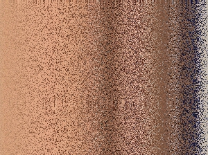
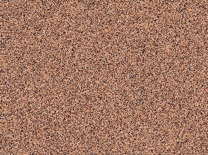

# PicEnc

encrypt and decrypt an image.

How to use: 

```
Illustration of PicEnc

Usage:
   [flags]
   [command]

Available Commands:
  completion  Generate the autocompletion script for the specified shell
  de          Decode a picture
  en          Encode a picture
  help        Help about any command
  version     Show version

Flags:
  -h, --help   help for this command

Use " [command] --help" for more information about a command.
```

## Encrypt image

command summary: 
```
Encode a picture

Usage:
   en [flags]

Flags:
  -f, --file string   The filepath of picture. (Required)
  -h, --help          help for en
  -k, --key float     The key to encrypt pictures. (Required) (default 0.1)
  -m, --mode int      The mode of encrypt. (Required, 1 - row, 2 - row and col)
  -t, --type string   The encrypt type. (Options: logistic) (default "logistic")
```

>The key must be in the range of (0,1)

Demo: 

* Encode a picture with only row mode:

    ```shell
    $ PicEnc en -f img/q.jpg -k 0.666 -m 1
    2022/05/13 14:38:57 Read image: q.jpg successfully, type:jpeg, cost: 0.001s
    2022/05/13 14:38:57 Encrypt image successfully, cost 0.011s
    2022/05/13 14:38:57 Successfully export file to o_q.jpg, cost 0.003s
    ```
   
* Encode a picture with row and col mode:
    ```shell
    $ PicEnc en -f img/q.jpg -k 0.666 -m 2
    2022/05/13 14:38:57 Read image: q.jpg successfully, type:jpeg, cost: 0.001s
    2022/05/13 14:38:57 Encrypt image successfully, cost 0.011s
    2022/05/13 14:38:57 Successfully export file to o_q.jpg, cost 0.003s
    ```
   
* Decode a picture with only row mode

  ```shell
  $ PicEnc en -f img/o_q.jpg -k 0.666 -m 1
  2022/05/13 14:38:57 Read image: o_q.jpg successfully, type:jpeg, cost: 0.001s
  2022/05/13 14:38:57 Encrypt image successfully, cost 0.011s
  2022/05/13 14:38:57 Successfully export file to o_o_q.jpg, cost 0.003s
  ```
   

## Acknowledge

This project abide by GNU General Public License v3.0.

The idea is originated from the paper "Chaotic Picture Scrambling Algorithm Based on Sort Transformation".

```
@article{Xiangdong2005ChaoticPS,
title={Chaotic Picture Scrambling Algorithm Based on Sort Transformation},
author={Liu Xiang-dong},
journal={Journal of Image and Graphics},
year={2005}
}
```